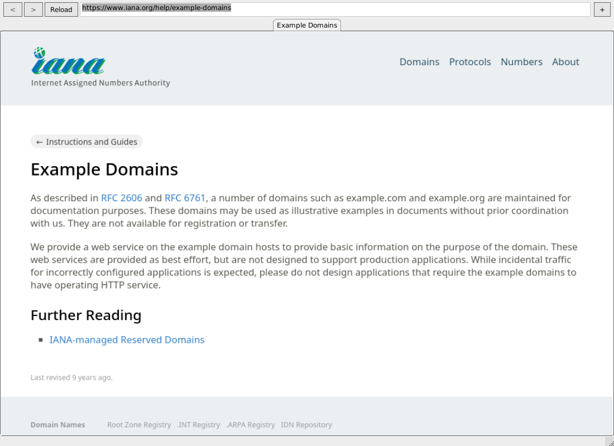

# GNUstep Browser

A native [GNUstep](https://gnustep.github.io/) web browser powered by **real WebKit**.

Not a wrapper around Chromium, and not a partial HTML renderer — this is the actual
WebKit engine (WPE WebKit) rendering into an AppKit `NSView`, with HarfBuzz text
shaping, Skia rasterisation and libsoup networking.



## Features

- Tabs
- Back / forward / reload / stop
- URL bar — explicit schemes pass through, bare hostnames get `https://`,
  anything else becomes a search
- Load progress and status line
- Per-tab titles
- In-page error pages
- Menu with the usual shortcuts (Cmd-N / T / W / L / R, Cmd-[ and Cmd-])
- `--snapshot` for headless page capture

## Requirements

- GNUstep (base, gui, back) installed under `/System`
- `WebKit.framework` in `/System/Library/Frameworks` — see below
- An X display

---

## Part 1 — Build and install WebKit

The browser needs `WebKit.framework`, which is built from a WebKit fork carrying a
GNUstep API layer. **This part takes 1.5–3 hours** and needs roughly 20 GB of disk.

Sections 1.1–1.6 build a minimal engine; 1.7 (video and audio) and 1.9 (WebRTC)
add to it afterwards, each re-compiling most of WebCore. If you already know a
machine wants the lot, **[1.10](#110-optional--everything-in-one-go)** folds all
three into a single package list and a single configure, so WebKit is compiled
once.

### 1.1 Install build dependencies

```sh
sudo apt-get update
sudo apt-get install -y --no-install-recommends \
  ninja-build ruby gperf unifdef cmake clang \
  libglib2.0-dev libharfbuzz-dev libicu-dev libjpeg-dev libpng-dev libwebp-dev \
  libepoxy-dev libgcrypt20-dev libsoup-3.0-dev libtasn1-6-dev libxkbcommon-dev \
  libxml2-dev libxslt1-dev libsqlite3-dev zlib1g-dev \
  libfreetype-dev libfontconfig-dev \
  libegl1-mesa-dev libgles2-mesa-dev libgl1-mesa-dev libdrm-dev
```

`bison` and `flex` are **not** needed. `ruby` and `gperf` are required by WebKit's
code generators and the build fails early without them.

### 1.2 Clone the fork

```sh
git clone https://github.com/pkgdemon/WebKit.git
cd WebKit
```

### 1.3 Configure

Set **all** install paths in one go — each lands in a generated config header, so
changing them later forces a partial rebuild.

```sh
export LANG=C.UTF-8 LC_ALL=C.UTF-8

cmake -S . -B ../webkit-build -GNinja \
  -DPORT=WPE -DCMAKE_BUILD_TYPE=Release \
  -DCMAKE_C_COMPILER=clang -DCMAKE_CXX_COMPILER=clang++ \
  -DENABLE_WPE_PLATFORM=ON -DENABLE_WPE_PLATFORM_HEADLESS=ON \
  -DENABLE_WPE_GNUSTEP_API=ON \
  -DENABLE_WPE_LEGACY_API=OFF -DENABLE_WPE_PLATFORM_DRM=OFF \
  -DENABLE_WPE_PLATFORM_WAYLAND=OFF -DUSE_GBM=OFF -DUSE_LIBDRM=ON \
  -DENABLE_WEBDRIVER=OFF \
  -DUSE_GSTREAMER=OFF -DENABLE_VIDEO=OFF -DENABLE_WEB_AUDIO=OFF \
  -DENABLE_WEB_CODECS=OFF -DENABLE_SPEECH_SYNTHESIS=OFF \
  -DENABLE_MEDIA_STREAM=OFF -DENABLE_MEDIA_RECORDER=OFF \
  -DUSE_AVIF=OFF -DUSE_JPEGXL=OFF -DUSE_WOFF2=OFF \
  -DENABLE_SPELLCHECK=OFF -DUSE_LIBHYPHEN=OFF \
  -DENABLE_INTROSPECTION=OFF -DENABLE_DOCUMENTATION=OFF \
  -DENABLE_JOURNALD_LOG=OFF -DUSE_LIBBACKTRACE=OFF \
  -DENABLE_BUBBLEWRAP_SANDBOX=OFF -DUSE_ATK=OFF -DUSE_FLITE=OFF \
  -DENABLE_GAMEPAD=OFF -DENABLE_WEBXR=OFF -DENABLE_MINIBROWSER=OFF \
  -DCMAKE_INSTALL_PREFIX=/System \
  -DCMAKE_INSTALL_LIBDIR=Library/Libraries \
  -DCMAKE_INSTALL_INCLUDEDIR=Library/Headers \
  -DCMAKE_INSTALL_DATADIR=Library/Application\ Support \
  -DLIB_INSTALL_DIR=/System/Library/Libraries \
  -DEXEC_INSTALL_DIR=/System/Library/Tools \
  -DLIBEXEC_INSTALL_DIR=/System/Library/Libraries/wpe-webkit-2.0
```

Confirm the GNUstep layer was found:

```
-- Found GNUstep: /System/Library/Tools/gnustep-config
--  ENABLE_WPE_GNUSTEP_API ................................. ON
```

### 1.4 Build

```sh
ninja -C ../webkit-build -j$(nproc)
```

Roughly 8,800 targets. Use fewer jobs if you have little RAM and no swap — the
link steps are memory hungry.

### 1.5 Install

```sh
sudo ninja -C ../webkit-build install
sudo ldconfig
```

Two workarounds are currently needed. WebKit's `wpe-webkit.pc.in` hardcodes
`includedir=${prefix}/include` and ignores `CMAKE_INSTALL_INCLUDEDIR`, so add a
compatibility symlink:

```sh
sudo ln -sfn Library/Headers /System/include
```

The framework installs its umbrella header as `WebKitGNUstep.h`, but the browser
imports `<WebKit/WebKit.h>`, so add it under that name too:

```sh
sudo ln -sfn WebKitGNUstep.h \
  /System/Library/Frameworks/WebKit.framework/Versions/0/Headers/WebKit.h
```

### 1.6 Verify

```sh
ls /System/Library/Frameworks/WebKit.framework/Versions/Current/libWebKit.so
ls /System/Library/Libraries/wpe-webkit-2.0/WPEWebProcess
ls /System/Library/Headers/WebKit/WebView.h
```

Installed layout:

| Path | Contents |
|---|---|
| `/System/Library/Libraries/libWPEWebKit-2.0.so.*` | the engine (~148 MB) |
| `/System/Library/Libraries/wpe-webkit-2.0/` | `WPEWebProcess`, `WPENetworkProcess`, injected bundle |
| `/System/Library/Frameworks/WebKit.framework/` | the GNUstep framework |
| `/System/Library/Headers/WebKit` -> framework Headers | so `#import <WebKit/WebKit.h>` works |
| `/System/Library/Libraries/libWebKit.so` -> framework binary | so `-lWebKit` works |

### 1.7 Optional — video and audio (GStreamer)

The steps above build WebKit without media support, so `<video>` and `<audio>` do
not work. Sites that assume they do can break; for example, imgur.com renders and
then goes grey. WPE plays media through GStreamer, which decodes most formats with
FFmpeg via `gstreamer1.0-libav`.

Install GStreamer:

```sh
sudo apt-get install -y --no-install-recommends \
  libgstreamer1.0-dev libgstreamer-plugins-base1.0-dev libgstreamer-plugins-bad1.0-dev \
  gstreamer1.0-plugins-base gstreamer1.0-plugins-good gstreamer1.0-plugins-bad gstreamer1.0-libav
```

Optional, Devuan only: if Mesa comes from `excalibur-backports`, apt stops with
`libgbm-dev : Depends: libgbm1 (= …)`. Add `libgbm-dev/excalibur-backports` to the
end of the command above so `libgbm-dev` matches the installed `libgbm1`.

Reconfigure with the extra arguments. CMake keeps every other setting from 1.3:

```sh
export LANG=C.UTF-8 LC_ALL=C.UTF-8

cmake -S . -B ../webkit-build \
  -DUSE_GSTREAMER=ON -DENABLE_VIDEO=ON -DENABLE_WEB_AUDIO=ON -DENABLE_MEDIA_SOURCE=ON
```

Confirm media support is on:

```
--  ENABLE_VIDEO ........................................... ON
--  ENABLE_WEB_AUDIO ....................................... ON
--  ENABLE_MEDIA_SOURCE .................................... ON
--  USE_GSTREAMER .......................................... ON
```

Then build and install again as in 1.4 and 1.5. Turning video on means most of
WebCore rebuilds, so this takes about as long as the first build. The symlinks
from 1.5 are kept.

### 1.8 Optional — ALSA output device

Only needed if you have no sound server (no PipeWire or PulseAudio) and hear
nothing. WebKit plays through GStreamer's default ALSA device, which is card 0,
device 0. That device does not exist on every machine — an NVIDIA card, for
example, numbers its HDMI outputs 3, 7, 8 and 9 — and playback then fails with
`unable to open slave`.

List the playback devices and find the one that is connected:

```sh
aplay -l
grep -l 'eld_valid[[:space:]]*1' /proc/asound/card*/eld#* | head   # live HDMI outputs
aplay -D plughw:0,3 -f cd -d 1 /dev/zero                           # test one, silently
```

Set that device as the default in `/etc/asound.conf`, going through `dmix` so
several programs can play at once and `plug` so formats are converted:

```
pcm.out_dmix {
    type dmix
    ipc_key 2048
    slave {
        pcm "hw:0,3"
        format S32_LE
        rate 48000
        channels 2
        period_size 1024
        buffer_size 8192
    }
}

pcm.!default {
    type plug
    slave.pcm "out_dmix"
}

ctl.!default {
    type hw
    card 0
}
```

Match `pcm "hw:0,3"` and `card 0` to your device. `format` matters: HDMI outputs
often accept only `S32_LE`, and `dmix` fails if it asks for 16-bit instead.

Test it, and on HDMI turn the digital output on if it is silent:

```sh
speaker-test -D default -c 2 -t wav -l 1
amixer -c 0 sset 'IEC958',0 on   # repeat for indexes 1..3 if needed
sudo alsactl store               # keep the switches after a reboot
```

Nothing needs restarting, but applications pick the device up only when they
start, so restart the browser.

### 1.9 Optional — WebRTC (video calls)

Only needed for sites that place calls in the browser, such as meet.jit.si,
which otherwise reports that WebRTC is not available. WPE builds WebRTC from
the libwebrtc sources bundled in the WebKit tree (400 MB of them), so this adds
roughly as much build time again as 1.4.

Each step below is separate; run them in order.

#### 1.9.1 Install the WebRTC dependencies

WebKit's libwebrtc needs libevent, ALSA and Opus, assembles its codec and
BoringSSL routines with `nasm`, and on Linux takes libvpx from the system.
ALSA and Opus are usually installed already:

```sh
sudo apt-get install -y --no-install-recommends \
  nasm libevent-dev libasound2-dev libopus-dev libvpx-dev
```

Without `nasm` the configure step stops with `No CMAKE_ASM_NASM_COMPILER could
be found`, and without `libvpx-dev` the build stops at
`'vpx/vpx_codec.h' file not found`: libwebrtc adds its own bundled libvpx
headers only on Apple platforms. `libpulse` is looked for as well but is
optional: it reports "libpulse is not found, not building support" and carries
on.

#### 1.9.2 Reconfigure

CMake keeps every other setting from 1.3 and 1.7:

```sh
cd ~/WebKit
export LANG=C.UTF-8 LC_ALL=C.UTF-8

cmake -S . -B ../webkit-build \
  -DENABLE_MEDIA_STREAM=ON -DENABLE_WEB_RTC=ON
```

Confirm both features are on before building:

```
--  ENABLE_MEDIA_STREAM .................................... ON
--  ENABLE_WEB_RTC ......................................... ON
```

#### 1.9.3 Build

```sh
ninja -C ../webkit-build -j$(nproc)
```

#### 1.9.4 Install

```sh
sudo ninja -C ../webkit-build install
sudo ldconfig
```

#### 1.9.5 Test

Open meet.jit.si. It should no longer report that WebRTC is unavailable.

#### 1.9.6 Known limits

- Camera and microphone access needs a permission request to be answered, which
  `WebKit.framework` does not implement yet, so `getUserMedia()` is refused even
  once WebRTC is compiled in. `RTCPeerConnection` itself exists, so a page stops
  reporting WebRTC as missing.
- Check the machine actually has capture hardware: `ls /dev/video*` for a
  camera, `arecord -l` for microphones.
- The installed engine grows: `libWPEWebKit-2.0.so` is about 148 MB without
  WebRTC.

### 1.10 Optional — everything in one go

Use this **instead of** 1.1, 1.3, 1.7 and 1.9 when the machine is meant to have
media and WebRTC from the start. Same result, but WebCore is compiled once rather
than three times. Expect roughly twice the 1.4 build time and more than 20 GB of
disk, since the bundled libwebrtc sources (400 MB) are built too.

#### Clean out a previous build

Skip this if you have not built before. Otherwise delete the build directory —
CMake caches every setting there, so anything an earlier configure left behind
(install paths, feature flags you are not passing this time) would survive into
this build:

```sh
cd ~/WebKit
rm -rf ../webkit-build
```

That reclaims the ~20 GB of objects and means a full rebuild; nothing short of it
is guaranteed to match a fresh configure. The clone itself is built out-of-tree
and stays as it is — keep it and skip 1.2, or `git pull` for a newer fork.

Nothing needs removing under `/System`: 1.5 installs over the top of an existing
engine and the two symlinks are kept. Rebuild the browser (Part 2) afterwards —
it takes seconds, and it is built against the framework you just replaced.

#### Install every dependency — base, GStreamer and WebRTC

```sh
sudo apt-get update
sudo apt-get install -y --no-install-recommends \
  ninja-build ruby gperf unifdef cmake clang \
  libglib2.0-dev libharfbuzz-dev libicu-dev libjpeg-dev libpng-dev libwebp-dev \
  libepoxy-dev libgcrypt20-dev libsoup-3.0-dev libtasn1-6-dev libxkbcommon-dev \
  libxml2-dev libxslt1-dev libsqlite3-dev zlib1g-dev \
  libfreetype-dev libfontconfig-dev \
  libegl1-mesa-dev libgles2-mesa-dev libgl1-mesa-dev libdrm-dev \
  libgstreamer1.0-dev libgstreamer-plugins-base1.0-dev libgstreamer-plugins-bad1.0-dev \
  gstreamer1.0-plugins-base gstreamer1.0-plugins-good gstreamer1.0-plugins-bad gstreamer1.0-libav \
  nasm libevent-dev libasound2-dev libopus-dev libvpx-dev
```

Devuan only: if Mesa comes from `excalibur-backports`, apt stops with
`libgbm-dev : Depends: libgbm1 (= …)`. Append `libgbm-dev/excalibur-backports` to
the command above so `libgbm-dev` matches the installed `libgbm1`.

#### Configure with the media and WebRTC flags on

Run this from inside the WebKit clone — clone it as in 1.2 if you do not have
one already:

```sh
export LANG=C.UTF-8 LC_ALL=C.UTF-8

cmake -S . -B ../webkit-build -GNinja \
  -DPORT=WPE -DCMAKE_BUILD_TYPE=Release \
  -DCMAKE_C_COMPILER=clang -DCMAKE_CXX_COMPILER=clang++ \
  -DENABLE_WPE_PLATFORM=ON -DENABLE_WPE_PLATFORM_HEADLESS=ON \
  -DENABLE_WPE_GNUSTEP_API=ON \
  -DENABLE_WPE_LEGACY_API=OFF -DENABLE_WPE_PLATFORM_DRM=OFF \
  -DENABLE_WPE_PLATFORM_WAYLAND=OFF -DUSE_GBM=OFF -DUSE_LIBDRM=ON \
  -DENABLE_WEBDRIVER=OFF \
  -DUSE_GSTREAMER=ON -DENABLE_VIDEO=ON -DENABLE_WEB_AUDIO=ON \
  -DENABLE_MEDIA_SOURCE=ON -DENABLE_MEDIA_STREAM=ON -DENABLE_WEB_RTC=ON \
  -DENABLE_MEDIA_RECORDER=OFF -DENABLE_WEB_CODECS=OFF \
  -DENABLE_SPEECH_SYNTHESIS=OFF \
  -DUSE_AVIF=OFF -DUSE_JPEGXL=OFF -DUSE_WOFF2=OFF \
  -DENABLE_SPELLCHECK=OFF -DUSE_LIBHYPHEN=OFF \
  -DENABLE_INTROSPECTION=OFF -DENABLE_DOCUMENTATION=OFF \
  -DENABLE_JOURNALD_LOG=OFF -DUSE_LIBBACKTRACE=OFF \
  -DENABLE_BUBBLEWRAP_SANDBOX=OFF -DUSE_ATK=OFF -DUSE_FLITE=OFF \
  -DENABLE_GAMEPAD=OFF -DENABLE_WEBXR=OFF -DENABLE_MINIBROWSER=OFF \
  -DCMAKE_INSTALL_PREFIX=/System \
  -DCMAKE_INSTALL_LIBDIR=Library/Libraries \
  -DCMAKE_INSTALL_INCLUDEDIR=Library/Headers \
  -DCMAKE_INSTALL_DATADIR=Library/Application\ Support \
  -DLIB_INSTALL_DIR=/System/Library/Libraries \
  -DEXEC_INSTALL_DIR=/System/Library/Tools \
  -DLIBEXEC_INSTALL_DIR=/System/Library/Libraries/wpe-webkit-2.0
```

Check the summary before building:

```
-- Found GNUstep: /System/Library/Tools/gnustep-config
--  ENABLE_WPE_GNUSTEP_API ................................. ON
--  ENABLE_VIDEO ........................................... ON
--  ENABLE_WEB_AUDIO ....................................... ON
--  ENABLE_MEDIA_SOURCE .................................... ON
--  USE_GSTREAMER .......................................... ON
--  ENABLE_MEDIA_STREAM .................................... ON
--  ENABLE_WEB_RTC ......................................... ON
```

#### Build

Same as 1.4. Roughly 8,800 targets, plus libwebrtc. Use fewer jobs if you have
little RAM and no swap — the link steps are memory hungry.

```sh
ninja -C ../webkit-build -j$(nproc)
```

#### Install

Same as 1.5, including the two symlink workarounds — `-sfn` so they are safe to
re-run on a machine that already has them:

```sh
sudo ninja -C ../webkit-build install
sudo ldconfig

sudo ln -sfn Library/Headers /System/include
sudo ln -sfn WebKitGNUstep.h \
  /System/Library/Frameworks/WebKit.framework/Versions/0/Headers/WebKit.h
```

Verify as in 1.6:

```sh
ls /System/Library/Frameworks/WebKit.framework/Versions/Current/libWebKit.so
ls /System/Library/Libraries/wpe-webkit-2.0/WPEWebProcess
ls /System/Library/Headers/WebKit/WebView.h
```

#### After that

Rebuild the browser from Part 2. Skip 1.7 and 1.9 — they are already included,
though the WebRTC test in 1.9.5 and the limits in 1.9.6 still apply. 1.8 is still
worth a look if the machine has no sound server.

---

## Part 2 — Build and install the browser

Fast — seconds, not hours.

```sh
git clone https://github.com/pkgdemon/gnustep-browser.git
cd gnustep-browser
make
sudo make install GNUSTEP_INSTALLATION_DOMAIN=LOCAL
```

Installs to `/Local/Applications/Browser.app`.

## Run

```sh
/Local/Applications/Browser.app/Browser
/Local/Applications/Browser.app/Browser https://example.com

# headless capture
/Local/Applications/Browser.app/Browser https://example.com --snapshot out.png
```

---

## How it works

```
  Browser.app                    (GNUstep / AppKit, Objective-C)
      |
  WebKit.framework               WebView : NSView
      |                          - SHM frame -> NSBitmapImageRep -> -drawRect:
      |                          - NSEvent -> WPEEvent
      |                          - GMainContext pumped from NSRunLoop
      |
  libWPEWebKit-2.0.so            UIProcess | WebProcess | NetworkProcess
      |
  Skia | HarfBuzz | libsoup | Mesa EGL
```

The engine renders offscreen into shared-memory buffers via WPEPlatform's headless
display. `WebKit.framework` converts each frame to an `NSBitmapImageRep` and blits
it into the view. Because WebKit's UIProcess is not thread-safe and WTF's
`RunLoopGLib` owns the default `GMainContext`, all WebKit calls happen on the AppKit
main thread and the GLib loop is driven from `NSRunLoop`.

## Known gaps

No `<video>`/`<audio>` unless WebKit is built with the optional GStreamer step
(1.7, or 1.10 for everything at once), which is off by default to halve build
time. `target=_blank` and
`window.open` open a new tab, but the page gets its own web process, so
`window.opener` and named targets do not connect. No context menus, script
dialogs, file chooser, downloads, bookmark or history persistence,
find-in-page, or IME yet. WebGL is compiled in.
